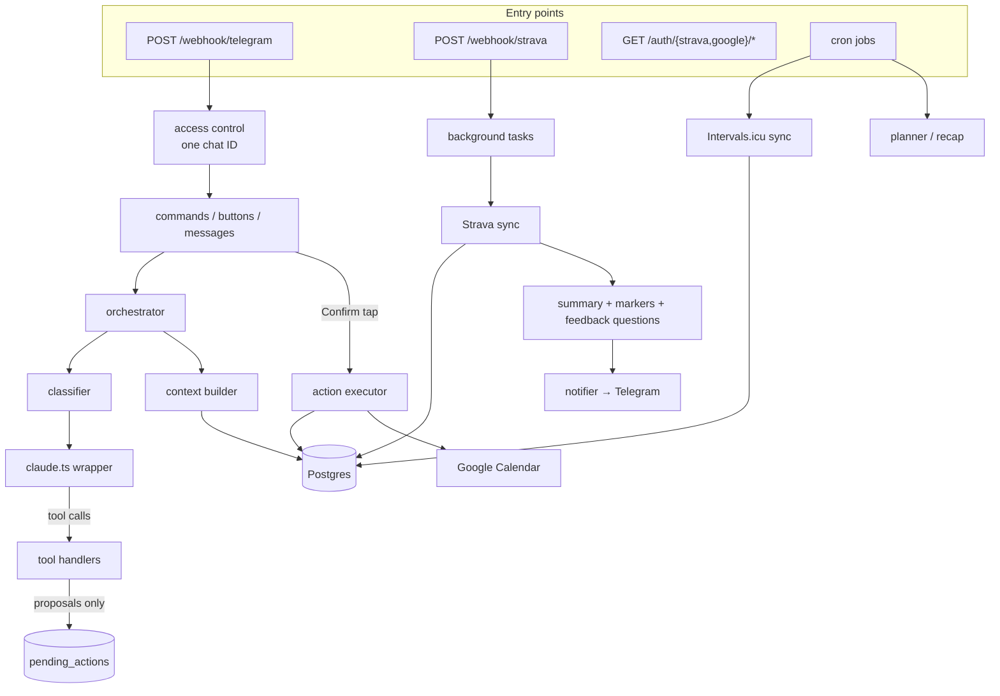

# 5. Architecture

A map of the code, for when you want to change something and need to know where it lives and why it's built that way. The reasoning behind each decision is in the [ADRs](../02-architecture-decisions.md). This page links to them rather than repeating them.

## The big picture

One Node.js process does everything:

- a **Fastify** HTTP server (Telegram webhook, Strava webhook, OAuth routes, `/health`, two static pages);
- a **grammY** bot, wired into that server in production and long polling in development;
- an in-process **scheduler** (`node-cron`) for the recap, the syncs, and the memory job;
- a **background task runner** for work that must not block a webhook response.

Postgres (Neon) holds all state. No in-memory state needs to survive a restart, except the literature vectors, which are reloaded from the database on boot.



## Directory layout

```text
src/
├── index.ts            Composition root: builds every module and wires dependencies. The only file that knows everything.
├── server.ts           Fastify instance, 5xx handler that alerts, /health
├── pages.ts            Static / and /privacy (needed for Google's consent screen)
├── config/             env.ts (zod-validated env, MODELS), pricing.ts
├── logging/            pino with secret redaction and scrubbing
├── bot/                Everything Telegram: setup, access control, webhook, commands,
│                       message and button handlers, HTML helpers, Markdown → HTML
├── agent/              Everything AI: claude.ts wrapper, budget, classifier, orchestrator,
│                       system prompt, context builder, tools and handlers, planner,
│                       activity summary, memory, proposals and their executor
├── training/           Pure sports-science code: zones, VDOT, phases, plan matching,
│                       field tests, breakthroughs, body composition
├── integrations/
│   ├── strava/         OAuth, REST client, webhook, activity sync, history import, mapper
│   ├── google/         OAuth, Calendar REST client, plan → events
│   ├── intervals/      REST client, wellness sync, threshold/profile sync, mappers
│   ├── trainingpeaks/  CSV import CLI
│   ├── oauth-crypto.ts AES-256-GCM for stored tokens
│   └── token-refresh.ts retry, backoff, and alert-once logic
├── knowledge/          Literature: extract, clean, chunk, embed, ingest CLI, in-memory search, eval
├── db/                 Drizzle schema and one store module per table
├── scheduler/          cron wrapper with failure-streak alerting
└── utils/              dates (time-zone-correct), secure compare, background tasks, process guards
drizzle/                Generated SQL migrations (applied on boot)
docs/                   Guides (this folder) and design records
```

**Conventions** (full list in [`docs/01-stack-and-principles.md`](../01-stack-and-principles.md)):

- One module, one responsibility. No file both queries the database and formats Telegram output.
- Modules are factories (`createX(deps)`) that take their dependencies as arguments. That's what makes almost everything testable without a network or database. Tests sit next to the code (`foo.ts` + `foo.test.ts`).
- Named exports only, no barrel files.
- Custom error classes per failure domain, caught at the boundary.

## Key flows

### A chat message

1. Telegram POSTs to `/webhook/telegram`. The `X-Telegram-Bot-Api-Secret-Token` header is checked in `onRequest`, before the body is parsed (`bot/webhook.ts`).
2. grammY middleware drops any update whose chat isn't `TELEGRAM_AUTHORIZED_CHAT_ID` (`bot/access-control.ts`).
3. If a conversation mode is open in `pending_actions` (recap answer, onboarding, or a feedback note), the message goes there. Otherwise the **classifier** picks a call type and model (`agent/classifier.ts`).
4. The **context builder** renders your profile, markers, goals, phase, this week's plan, recent activities, wellness, feedback and memory notes as text (`agent/context.ts`).
5. The **Claude wrapper** (`agent/claude.ts`) checks the budget, sends `system = [static prompt (cached 1 h), dynamic context]` plus the last 20 turns and the tools, logs usage and cost to `llm_usage`, and fires budget alerts.
6. Tool calls (`propose_goal`, `propose_profile_update`, `propose_fitness_marker`, `propose_week_plan`, `search_literature`) are handled in `agent/tool-handlers.ts`. The propose tools only write a `pending_actions` row.
7. The reply is converted from light Markdown to Telegram HTML and sent. Each proposal follows as its own message with Confirm and Cancel buttons, rendered by code from the stored payload.
8. The full content blocks, including `tool_use` and `tool_result`, are stored in `conversations.content` as `jsonb`, so history replays exactly ([ADR-003](../02-architecture-decisions.md#adr-003-conversation-storage-stores-full-content-blocks-not-plain-text)).

### A confirmation tap

`callback_data = pa:<id>:ok`. The executor consumes the row with `DELETE … RETURNING` (so a double tap runs once), validates the payload with zod again, and applies it: writes goals, markers or the profile, or saves the plan and books it in Google Calendar with deterministic event IDs, so a retry never duplicates events. On failure the row is restored and the buttons stay ([ADR-007](../02-architecture-decisions.md#adr-007-pending-action-state-is-persisted-not-in-memory)).

### A new Strava activity

1. Strava POSTs an event. The app checks `subscription_id` and `owner_id`, answers `200` immediately, and hands the event to a background task ([ADR-012](../02-architecture-decisions.md#adr-012-every-inbound-webhook-is-authenticated-before-it-is-parsed)).
2. The activity is **re-fetched from the Strava API**, because events aren't signed, and upserted by `external_id` only if it belongs to the connected athlete. Deletes and deauthorizations are confirmed with the API the same way before anything is removed.
3. On `create` only: summary (numbers rendered by code, comment by Haiku), then threshold proposals (field test or breakthrough), then feedback questions, then the plan match and Strava rename. Each step is ordered so that a failure late in the chain can't hold back what you've already seen.

### The weekly plan

`agent/planner.ts`: refresh thresholds from Intervals.icu (best effort), build an extended context (6 weeks of per-sport totals, 12 months of monthly totals and peaks, CTL/ATL/ACWR, session-RPE load, calendar events for the week), then make one Sonnet call with **structured output** (the week-plan JSON schema). The call can make up to two `search_literature` rounds first. The result becomes an `apply_plan` proposal.

## Data model

All tables are defined in [`src/db/schema.ts`](../../src/db/schema.ts). The migrations in `drizzle/` run on every boot.

| Table | Holds |
|---|---|
| `athlete_profile` | Name, applied zones, background (`jsonb`), preferences, injury notes |
| `fitness_markers` | Dated history of FTP, LTHR, max HR, threshold pace, CSS and VDOT, each with its source ([ADR-016](../02-architecture-decisions.md#adr-016-fitness-baseline--how-the-agent-knows-the-athletes-current-level)) |
| `events`, `goals` | Dated races and A/B/C goals, at most one active A goal per season ([ADR-010](../02-architecture-decisions.md#adr-010-season-goals-are-first-class-anchored-to-dated-events)) |
| `activities` | Strava and TrainingPeaks activities, with `raw_data` |
| `activity_feedback` | RPE, feel, pain and notes per activity ([ADR-018](../02-architecture-decisions.md#adr-018-post-activity-feedback-lives-in-its-own-table)) |
| `health_metrics` | One row per day: sleep, HRV, resting HR, stress, weight, body fat, CTL, ATL, ramp rate |
| `training_plans` | One row per week: the structured plan (`jsonb`) with calendar and Strava links |
| `pending_actions` | Proposals awaiting a tap, and open conversation modes, each with an expiry |
| `conversations` | Every turn as full Anthropic content blocks (`jsonb`) |
| `conversation_memories` | Monthly summaries of turns older than 60 days |
| `llm_usage` | One row per Claude or embedding call: tokens, cache tokens, cost in EUR, call type |
| `oauth_tokens` | Strava and Google tokens, AES-256-GCM encrypted |
| `oauth_states` | Single-use OAuth `state` values, 10-minute expiry |
| `literature_chunks` | Ingested text chunks, with their embeddings (`real[]`) and the embedding model |

## Cost control by design

- **Prompt caching** ([ADR-004](../02-architecture-decisions.md#adr-004-system-prompt-caching--split-static-from-dynamic)): tools and the static prompt (~7.7K tokens) form a byte-identical prefix cached for 1 hour. Only the dynamic context and the conversation are billed at the full input price.
- **Routing** ([ADR-005](../02-architecture-decisions.md#adr-005-thinking-and-effort-policy-per-call-type)): Sonnet with low or medium effort where judgment matters, Haiku for the rest. If a Haiku call tries to write a week plan, the round is redone on Sonnet.
- **Code instead of calls:** feedback buttons, threshold maths, plan matching and proposal rendering need no model call.
- **The budget** is checked before every call and enforced in the wrapper, so there's no way around it.

## Testing

- `npm run check` runs Biome, `tsc --noEmit` and Vitest (about 470 tests).
- Stores and clients are injected, so tests use fakes. There are no network calls and no database in the test suite.
- Fixtures under `src/integrations/*/test-fixtures.ts` follow real API response shapes with **fake values**. Keep it that way if you add any: never paste a real response containing your IDs, tokens or health data.
- The retrieval eval (`src/knowledge/retrieval-eval.test.ts`) checks recall@5 against cached embedding vectors, so it runs offline.
